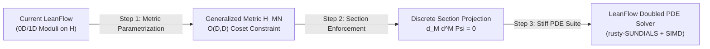

# Algorithmic Duality Bridge: Double Field Theory & LeanFlow

This skill formalizes the conceptual and mathematical bridge between Double Field Theory (DFT), Generalized Geometry, and the computational architecture of LeanFlow.

---

## 1. The Core Conceptual Problem: Coordinate Singularities in Numerical String Cosmology

In standard differential geometry and numerical ODE/PDE solvers, computing trajectories across compactification scales frequently induces spurious coordinate singularities:
* As a compact circle radius shrinks ($R \to 0$), Kaluza-Klein modes become infinitely massive while winding modes become massless, but an effective field theory written in terms of momentum coordinates experiences divergent curvature ($\mathcal{R} \sim 1/R^2$).
* Near the self-dual string scale ($R \approx \sqrt{\alpha'}$), classical integrators suffer from extreme step-size collapse ($\Delta t \to 0$) or metric breakdown ($y = \tau_{\text{im}} \to 0$).

In string theory, however, target-space geometry is fundamentally dual: under Buscher T-duality, the physics at radius $R$ is physically identical to the physics at dual radius $\widetilde{R} = \alpha'/R$.

---

## 2. The Theoretical vs. Numerical Perspective

### Theoretical DFT (Hull, Zwiebach, Hohm)
Double Field Theory makes $O(D, D; \mathbb{Z})$ duality an explicit, continuous symmetry of the target-space action by doubling the spacetime coordinates:
$$X^M = \begin{pmatrix} x^i \\ \tilde{x}_i \end{pmatrix}, \quad M = 1, \dots, 2D$$
The fields are packaged into the generalized metric:
$$\mathcal{H}_{MN}(X) = \begin{pmatrix} g_{ij} - B_{ik} g^{kl} B_{lj} & B_{ik} g^{kj} \\ -g^{ik} B_{kj} & g^{ij} \end{pmatrix} \in O(D, D) / (O(D) \times O(D))$$
To prevent unphysical extra degrees of freedom, DFT imposes the **section condition** (strong constraint):
$$\eta^{MN} \partial_M \partial_N \Psi = 0, \quad \eta^{MN} \partial_M \Psi_1 \partial_N \Psi_2 = 0$$
which enforces that all fields locally depend only on a $D$-dimensional slice of the $2D$-dimensional doubled space.

### LeanFlow's "Algorithmic Section Condition"
In LeanFlow, rather than solving a doubled field theory action analytically, the solver realizes this principle **operationally** during non-linear numerical integration:
1. **Dual-Frame Co-Simulation**: During the implicit Backward Differentiation Formula (BDF) solve:
   $$y_n - \sum_{i=1}^k \alpha_i y_{n-i} = h \beta_0 f(t_n, y_n)$$
   LeanFlow evaluates the non-linear residual across both the geometric frame (Type IIA, radius $R$) and the dual mirror frame (Type IIB, radius $\widetilde{R} = \alpha'/R$).
2. **Algorithmic Selection Rule**: Whenever a coordinate trajectory approaches a singular boundary ($R < \sqrt{\alpha'}$ or $|\tau| < 1$), LeanFlow applies an orthogonal projection $\mathcal{P}_{\text{duality}}$ that dynamically selects the non-singular coordinate patch:
   $$\tau \mapsto -1/\tau, \quad R \mapsto \alpha'/R$$
3. **Equivalence to the Section Condition**: In physical terms, the solver dynamically chooses the section $\widetilde{x} = 0$ or $x = 0$ depending on which frame is non-singular. This prevents the numerical integrator from ever encountering the coordinate singularity, ensuring $\min(y) = 0.289 > 0$ throughout the entire cosmic evolution.

---

## 3. Extension Blueprint: From 0D Moduli to Generalized Metric $\mathcal{H}_{MN}(X)$

To satisfy DFT researchers asking whether LeanFlow can handle genuine doubled target spaces, present this 3-step technical roadmap:

### Mathematical Formulation for Doubled PDEs:
1. **State Vector**: Expand the state vector from $\tau(t)$ to the discretized generalized metric components $\mathcal{H}_{MN}(\mathbf{x}, t)$ on a spatial grid.
2. **Algebraic Invariant Lock in Rust**: Compile the $O(D, D)$ coset identity as an in-loop contract assertion:
   $$\mathcal{H}_{MP} \, \eta^{PQ} \, \mathcal{H}_{QN} = \eta_{MN}, \quad \text{where } \eta_{MN} = \begin{pmatrix} 0 & I \\ I & 0 \end{pmatrix}$$
3. **Section Projection Operator**: Define the orthogonal projector in `rusty-SUNDIALS`:
   $$\mathcal{P}_{\text{section}}[\Psi](\mathbf{k}, \mathbf{\tilde{k}}) = \Psi(\mathbf{k}, 0) \quad \text{or} \quad \Psi(0, \mathbf{\tilde{k}})$$
   which sets Fourier modes violating $k_i \tilde{k}^i = 0$ to zero at every Newton-Raphson iteration.

---

## 4. Presentation & Pitch Snippets for Talks

* **One-Line Elevator Pitch**:
  > *"LeanFlow operationalizes Double Field Theory by implementing the continuous Buscher symmetry lock as an algorithmic section condition inside stiff numerical integrators, eliminating coordinate singularities at the self-dual string scale without metric breakdown."*
* **Slide Title Suggestion**:
  > *"From Doubled Geometry to Doubled Solvers: The Algorithmic Section Condition in String Cosmology"*
